# DocVision OCR

DocVision OCR is a production-grade AI system that transforms PDF documents into an interactive question-answering platform. The system is live and publicly accessible at https://huggingface.co/spaces/Ak47-model-ml/DocMind-AI.

Upload any PDF, including scanned and image-based files, and ask natural language questions about its content. The system extracts, understands, and reasons over documents using a pipeline of specialized AI agents powered by the Groq API with LLaMA 3, returning grounded, source-attributed answers.

This project was built to go beyond a simple chatbot wrapper. It integrates retrieval-augmented generation, multi-agent orchestration, OCR processing, semantic search, hallucination detection, and document intelligence into a single deployable application, reflecting how AI systems are engineered in professional environments.

## Architecture

The system follows a multi-agent pipeline. Each agent has a single well-defined responsibility and communicates through a shared context object. This keeps the architecture modular, testable, and easy to extend.

  

---

## Agents

**i. Orchestrator Agent**  
Classifies incoming queries, determines execution flow, coordinates inter-agent communication, and generates contextual follow-up suggestions to improve interaction continuity.

**ii. Retrieval Agent**  
Performs hybrid retrieval using TF-IDF keyword search and FAISS semantic vector search, followed by cross-encoder reranking to surface the most relevant document chunks.

**iii. Reasoning Agent**  
Executes structured intermediate reasoning over retrieved context, breaking complex questions into interpretable reasoning steps before response synthesis.

**iv. Summarizer Agent**  
Generates the final grounded response by synthesizing retrieved evidence and adapting answer structure, tone, and formatting based on query intent.

**v. Hallucination Guard**  
Validates generated responses against source document chunks using confidence scoring and semantic overlap verification to reduce unsupported outputs.

**vi. Report Agent**  
Produces structured Word reports containing generated answers, supporting reasoning traces, extracted evidence, and source attribution for downstream use.

**vii. Insights Agent**  
Provides optional post-processing intelligence including document summarization, topic extraction, difficulty estimation, note generation, and automatic exam-style question creation.

The backend is FastAPI. The frontend is Gradio with seven tabs. Both run in the same container as separate processes, with Gradio calling FastAPI internally over the local network. This mirrors a microservices pattern and avoids the routing conflicts that occur when Gradio is mounted inside FastAPI as a sub-application.

## Technology Stack

    Backend API          FastAPI with Uvicorn
    Frontend             Gradio 6
    LLM                  LLaMA 3.3 70B via Groq API, automatic fallback to LLaMA 3.1 8B
    Embeddings           Sentence Transformers, model all-MiniLM-L6-v2
    Vector Search        FAISS with hybrid TF-IDF and semantic scoring, weighted 30 to 70
    Reranking            Cross-Encoder, model ms-marco-MiniLM-L-4-v2
    OCR                  EasyOCR combined with PyMuPDF
    Text Chunking        NLTK sentence tokenization with configurable overlap
    Report Export        python-docx for Word document generation
    Deployment           Hugging Face Spaces
    Language             Python 3.9 and above

## Features

**Document Processing and Retrieval**

i.   Handles both digital and scanned PDFs through automatic OCR fallback when extracted text is insufficient
ii.  Sentence-aware chunking preserves context across chunk boundaries using configurable overlap
iii. Hybrid retrieval combines TF-IDF keyword matching with FAISS semantic search for high recall
iv.  Cross-encoder reranking re-scores the retrieved candidates before passing the top results to the LLM
v.   Multi-document sessions are supported with per-document metadata tracking and cross-document querying

**Query Intelligence and Memory**

i.   Automatic query classification into seven types: summarization, comparison, definition, extraction, steps, example, and factual
ii.  Each query type maps to a dynamically constructed prompt template that shapes the LLM response format
iii. Conversation memory retains up to six prior turns and detects follow-up questions by pattern matching
iv.  Follow-up questions augment the retrieval query with context from the previous turn for better results
v.   Response tone is configurable per query: professional, simple, technical, or academic

**Hallucination Detection**

i.   Every answer is validated against the retrieved chunks using two independent signals
ii.  The first signal is the reranking confidence score from the cross-encoder
iii. The second signal is the lexical overlap ratio between significant words in the answer and the source text
iv.  Answers that fail either check are flagged with a clear explanation surfaced in both the UI and the report
v.   This approach avoids a second LLM call for verification, keeping latency and cost low

**Document Insights**

i.   Auto-summary generates a structured document overview with key points and conclusion
ii.  Key topic extraction identifies main themes and provides a one-sentence description for each
iii. Difficulty analysis categorizes the content as beginner, intermediate, or advanced and identifies specific concepts in each tier
iv.  Smart notes generator produces revision-ready structured notes from the document
v.   Exam question generator creates short-answer questions, long-answer questions, and multiple-choice questions with correct answers

**Report and Export**

i.   Every Q&A session automatically generates a downloadable Word report containing the question, reasoning notes, answer, sources with relevance scores, and session metadata
ii.  A full insights report compiles all insight types into one Word document on demand
iii. Report filenames are derived from the question text and document name for easy identification

**Transparency and Observability**

i.   The RAG Debug Viewer tab exposes every retrieved chunk with its TF-IDF score, rerank score, and text preview for the most recent query
ii.  The Evaluation Dashboard displays total queries, average response time, chunks indexed, memory turns in use, and a full query log with types, confidence scores, and hallucination flags
iii. These tabs make the internal behavior of the retrieval pipeline fully visible, which is important for debugging, evaluation, and demonstrating genuine RAG understanding

## Project Structure

    app.py                Entry point, starts FastAPI and Gradio as separate processes
    api.py                FastAPI backend with all REST endpoints
    ui.py                 Gradio frontend with seven feature tabs
    agents.py             Orchestrator, Retrieval, Reasoning, Summarizer, Hallucination Guard, Report, and Insights agents
    core.py               PDF extraction, OCR, sentence chunking, hybrid retrieval, reranking, document store
    llm.py                LLM abstraction layer with Groq integration and extractive fallback
    config.py             All settings in a single typed dataclass, loaded from environment variables
    cache.py              Two-layer cache combining in-memory LRU and disk-based pickle with TTL
    requirements.txt      All Python dependencies
    .env                  API keys, excluded from version control
    .gitignore            Excludes secrets, caches, generated reports, and virtual environment

## API Reference

    POST   /upload              Upload and process one or more PDF files
    POST   /query               Submit a question, returns answer, sources, confidence, and report info
    GET    /stream              Server-Sent Events stream for token-by-token answer delivery
    POST   /insights            Generate a specific insight for the loaded documents
    POST   /insights/report     Build and return a compiled insights Word document
    GET    /history             Retrieve Q&A conversation history for the current session
    GET    /documents           List currently processed documents
    DELETE /documents           Clear all documents and conversation memory
    DELETE /memory              Clear conversation memory only, keep documents indexed
    GET    /rag-debug           Full debug data from the most recent query pipeline execution
    GET    /metrics             System performance metrics and retrieval configuration
    GET    /reports/filename    Download a specific generated Word report by filename
    GET    /health              Health check with LLM backend status and system state

## Configuration

All settings live in config.py and can be overridden using environment variables or the .env file.

    GROQ_API_KEY            API key for Groq, required for LLM-generated answers
    GROQ_MODEL              Primary model, default is llama-3.3-70b-versatile
    GROQ_FALLBACK_MODEL     Fallback model used on rate limits or server errors, default is llama-3.1-8b-instant
    GROQ_MAX_TOKENS         Maximum completion tokens per LLM call, default is 1024
    EMBEDDING_MODEL         Sentence Transformer model identifier for semantic search
    RERANKER_MODEL          Cross-Encoder model identifier for reranking
    CHUNK_SIZE              Maximum characters per text chunk, default is 500
    CHUNK_OVERLAP           Sentence overlap between consecutive chunks, default is 50
    TOP_K_AFTER_RERANK      Number of chunks passed to the LLM after reranking, default is 8
    LEXICAL_WEIGHT          TF-IDF contribution to the hybrid retrieval score, default is 0.3
    SEMANTIC_WEIGHT         Embedding similarity contribution to the hybrid score, default is 0.7
    MEMORY_MAX_TURNS        Maximum conversation turns retained in memory, default is 6
    MAX_PDFS                Maximum number of PDFs per upload session, default is 10

## Setup

i.   Clone the repository

        git clone https://github.com/YOUR_USERNAME/docvision-ocr.git
        cd docvision-ocr

ii.  Create and activate a virtual environment

        python -m venv .venv

        On Windows:   .venv\Scripts\activate
        On Mac/Linux: source .venv/bin/activate

iii. Install all dependencies

        pip install -r requirements.txt

iv.  Add your Groq API key

     Open the .env file and set the following. A free key is available at https://console.groq.com

        GROQ_API_KEY=gsk_your_key_here

v.   Run the project

        python app.py

## Notable Design Decisions

**Why FastAPI and Gradio run as separate processes**

Gradio 6 introduced an experimental SSR rendering mode and changed how its static assets are served. When Gradio is mounted inside FastAPI at a sub-path using the standard mount method, the asset routing breaks under the Hugging Face Spaces reverse proxy, producing a blank page. Running both as independent processes on separate internal ports avoids this entirely and also mirrors how services would be separated in a real production system.

**Why hallucination detection does not use a second LLM call**

Calling the LLM again to verify its own output adds latency, doubles token cost, and does not reliably catch hallucinations because the same model tends to agree with itself. The approach here uses two lightweight signals that are already available from the retrieval step: the reranking confidence score and the lexical overlap ratio between the answer and its source chunks. This gives a practical and fast approximation of groundedness at zero additional cost.

**Why the LRU and disk cache are layered**

The in-memory LRU cache handles repeated queries within a session at microsecond speed. The disk cache handles cases where the server restarts between requests, which is common on free-tier cloud deployments that sleep after periods of inactivity. Values promoted from disk to memory on first access avoid repeated disk reads for warm data.

## Live Demo

https://huggingface.co/spaces/Ak47-model-ml/DocMind-AI
